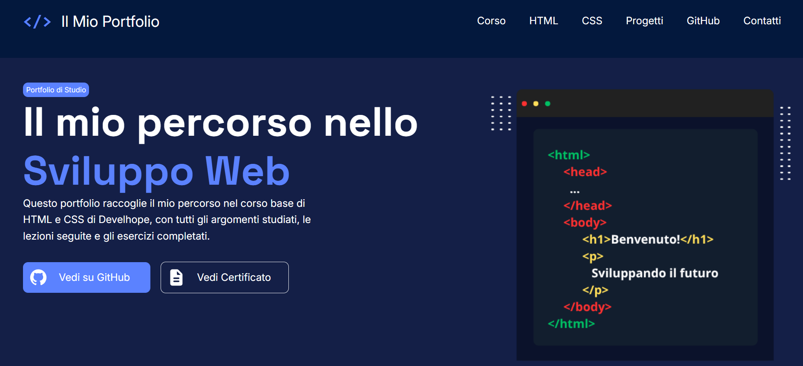
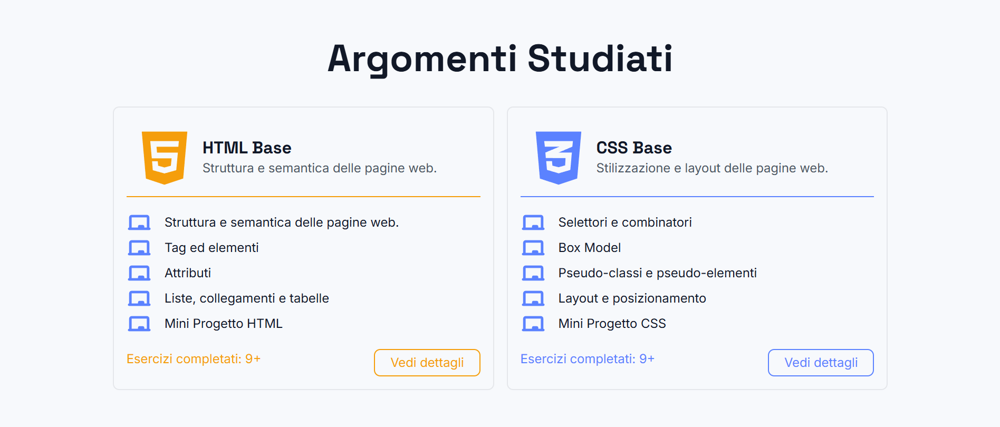
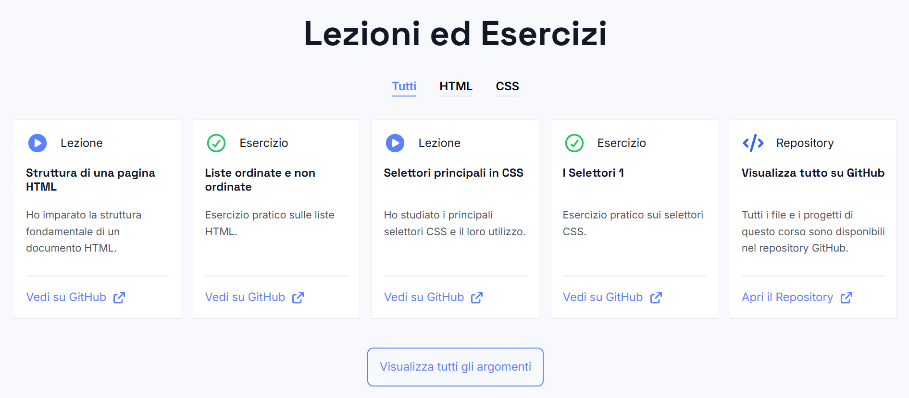

# Web Fundamentals

Repository dedicated to revisiting and strengthening core front-end development concepts using HTML5 and CSS3.

This project is part of a practical learning journey focused on building real web pages from scratch while reinforcing semantic HTML, clean CSS architecture, BEM methodology, Git workflow and GitHub Pages deployment.

## Project

The main project is a simple landing page portfolio created to present the topics studied during a basic HTML and CSS course.

It includes:

- Course overview
- HTML and CSS topic cards
- Lessons and exercises section
- GitHub links
- Contact area
- Responsive layout structure
- Organized CSS architecture

## Live Demo

The project is available on GitHub Pages.

```txt
https://NicolauAlfredo.github.io/web-fundamentals/
```

## Structure

```txt
web-fundamentals/
│
├── assets/
│ 
├── lessons/
│   ├── html/
│   └── css/
│
├── project/
│   └── index/
│       ├── assets/
│       ├── css/
│       │   ├── base/ 
│       │   ├── layout/
│       │   ├── sections/
│       │   └── main.css
│       └── index.html
│
├── .github/
│   └── workflows/
│       └── deploy.yml
│
├── .gitignore
└── README.md
```

# Topics Covered
- HTML
    - Document structure
    - Semantic HTML
    - Tags and elements
    - Attributes
    - Headings and paragraphs
    - Lists
    - Links
    - Tables
    - Forms
    - Media
    - Accessibility basics

- CSS
    - CSS syntax
    - Selectors
    - Attribute selectors
    - Pseudo-classes
    - Pseudo-elements
    - Combinators
    - Box model
    - Inline boxes
    - Overflow
    - Flexbox basics
    - CSS variables
    - Responsive layout basics

CSS Architecture

The CSS is organized into small and focused files:

```txt
css/
│ 
├── base/
│   ├── reset.css
│   ├── typography.css
│   └── variables.css
│
├── layout/
│   ├── footer.css
│   └── header.css
│
├── sections/
│   ├── about.css
│   ├── hero.css
│   ├── lessons.css
│   ├── more-topics.css
│   └── topics.css
│
└── main.css
```
## Screenshots

### Header & Hero



---

### Course Overview


---

### Study Topics



---

### Lessons & Exercises



---

### Footer


# Technologies 
- HTML5
- CSS3
- Git
- GitHub
- GitHub Pages
- GitHub Actions

# Deployment

This project is deployed using GitHub Pages with GitHub Actions.

Because the main index.html file is inside:
```txt
project/index.html
```

the deployment workflow publishes that folder directly to GitHub Pages.

# Author

Nicolau Alfredo
